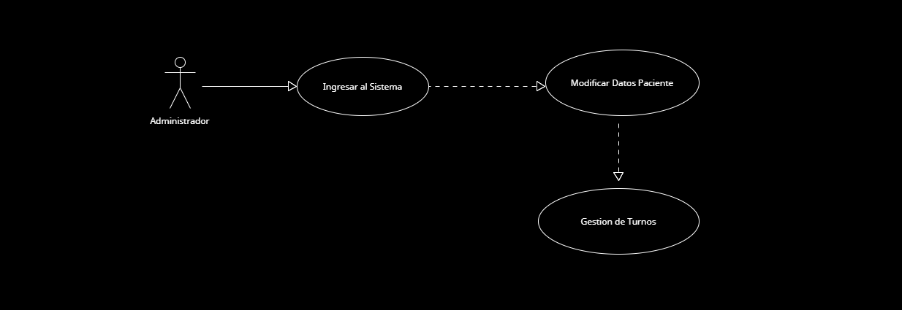

* **Caso de Uso 2 - Modificar Datos de un Paciente**: El administrador utiliza el sistema para ingresar y modificar los datos de un paciente para luego poder solicitar turnos.

  

[Accede a Drive para verlo en Línea](https://drive.google.com/file/d/137SmnmV2yGg1qBz2xpPxEuguLcNg-f_d/view?usp=sharing)
