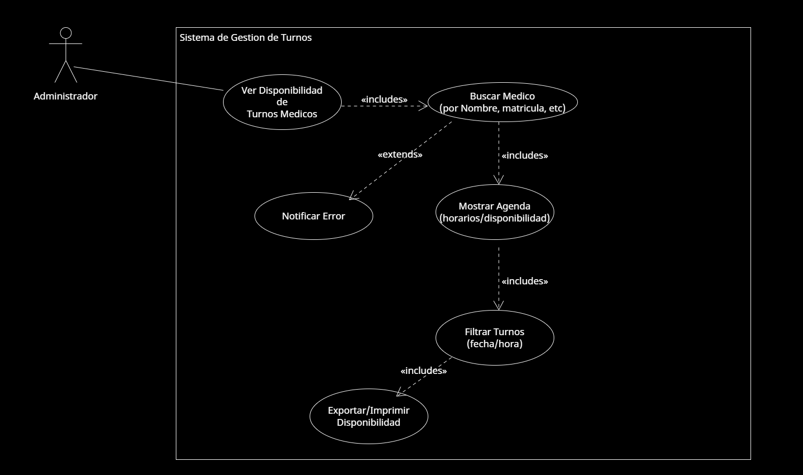

* **Caso de Uso 3 - Ver Disponibilidad de Turnos de un Médico**: El administrador ingresa al sistema para consultar la disponibilidad de turnos de un medico en especifico.

  

[Accede a Drive para verlo en Línea](https://drive.google.com/file/d/1zgfsZem3_aVL5dzqOXtYDXAG2MWKvS1W/view?usp=sharing)
