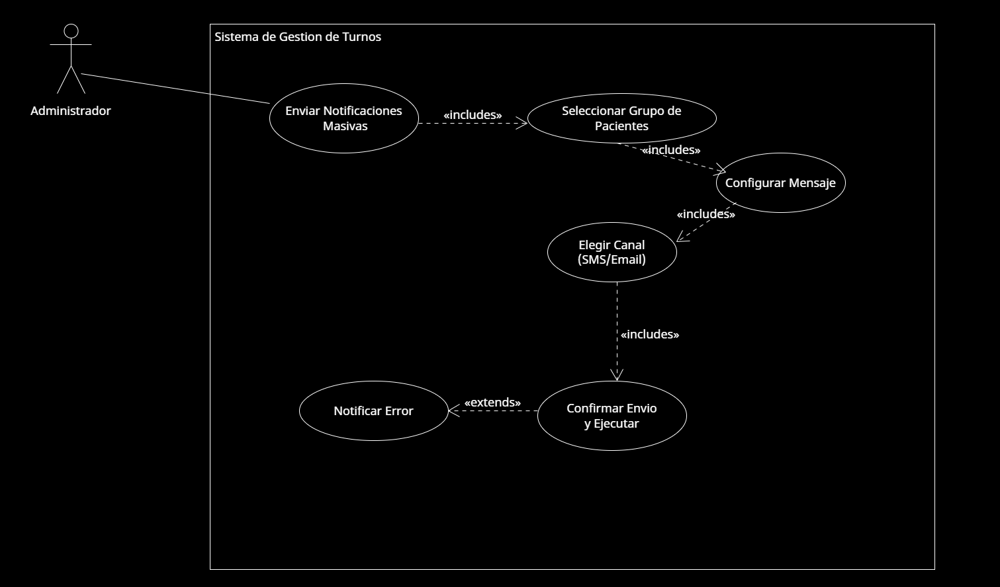

* **Caso de Uso 4 - Enviar Notificaciones Masivas a Pacientes**: El administrador ingresa al sistema para ingresar y poder enviar notificación masiva via email o sms a pacientes sobre sus turnos.

  

[Accede a Drive para verlo en Línea](https://drive.google.com/file/d/1CUt2Ebprb4srw-6BaQ8dute2gm4tr1k4/view?usp=sharing)
