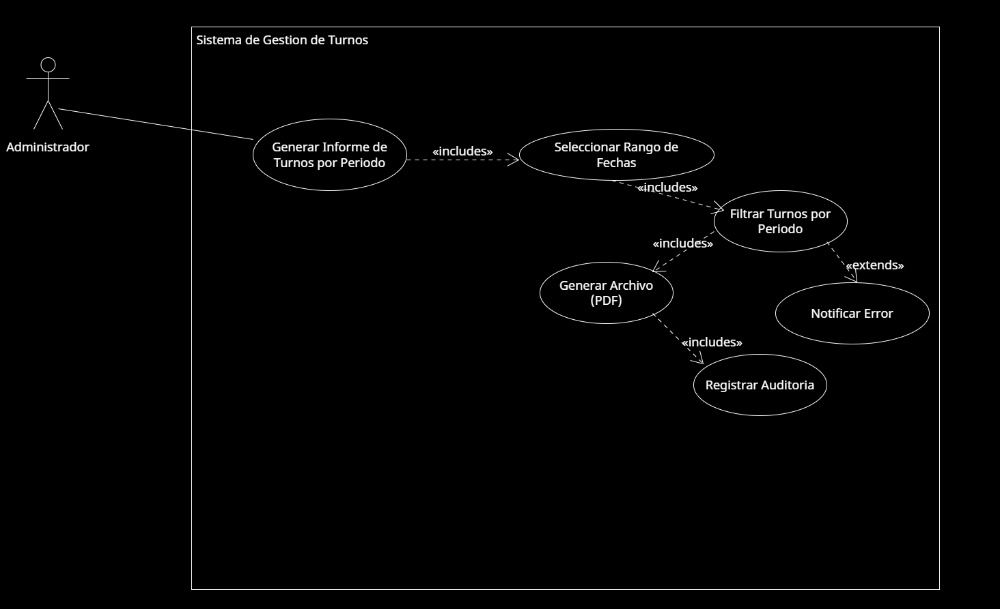

* **Caso de Uso 5 - Generar Informe de Turnos por Período**: El administrador del centro de salud ingresa al sistema para poder generar un informe de los turnos realizados hasta tal fecha, dia y horario.

  

[Accede a Drive para verlo en Línea](https://drive.google.com/file/d/1s_0chlHR6S94XuepeMqylFB28SbJ_nXS/view?usp=sharing)
