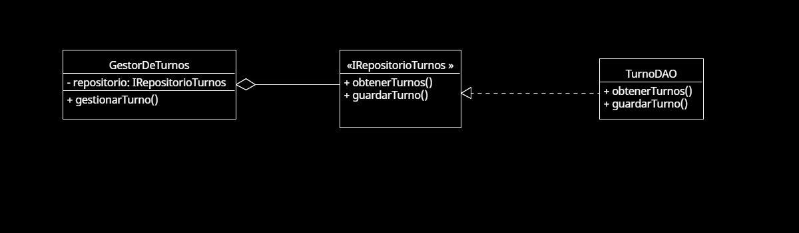

# Principio de Inversión de Dependencias (DIP)

## Propósito y Tipo del Principio SOLID
El **Principio de Inversión de Dependencias (DIP)** establece que los módulos de alto nivel no deben depender de módulos de bajo nivel, sino que ambos deben depender de abstracciones. Las abstracciones no deben depender de los detalles, sino que los detalles deben depender de las abstracciones.

En el Sistema de Gestión de Turnos, este principio se aplicó para desacoplar las clases que gestionan la lógica de negocio de las que manejan la persistencia o detalles técnicos, facilitando el mantenimiento y la escalabilidad.

---

## Motivación
Inicialmente, el sistema estaba diseñado de manera que las clases principales como `GestorTurnos` dependían directamente de implementaciones concretas como `TurnoDAO`, lo que dificultaba la reutilización del código y su prueba unitaria.

Para resolverlo, se introdujeron interfaces como `ITurnoRepository`, que definen los contratos que deben cumplir las clases encargadas de la persistencia. De esta forma, `GestorTurnos` depende de una abstracción en lugar de una implementación concreta.

**Ejemplo del mundo real**:  
Es como si una clínica definiera un protocolo de comunicación para turnos médicos. No importa si se usa un sistema digital o papel físico, mientras ese protocolo se cumpla. Así, cambiar el "cómo" sin afectar el "qué" es posible gracias al DIP.

---

## Estructura de Clases
El siguiente diagrama UML muestra cómo las clases del sistema dependen de interfaces y no de implementaciones concretas:

- `GestorTurnos` depende de `ITurnoRepository`
- `TurnoDAO` implementa `ITurnoRepository`

Esto permite cambiar la fuente de datos (por ejemplo, de una base de datos SQL a una API REST) sin modificar la lógica de negocio del sistema.

> El diagrama evidencia cómo la inversión de dependencias permite una arquitectura más flexible, desacoplada y fácil de extender.
