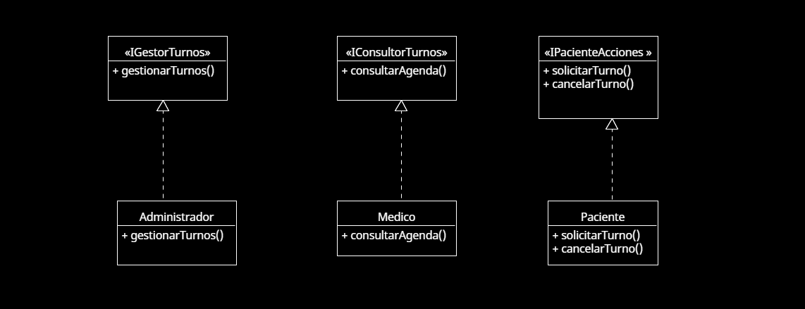

# Principio de Segregación de Interfaces (ISP)

## Propósito y Tipo del Principio SOLID
El **Principio de Segregación de Interfaces (ISP)** propone que los clientes no deben verse forzados a depender de interfaces que no utilizan. En otras palabras, es mejor tener varias interfaces específicas en lugar de una sola general que obligue a implementar métodos innecesarios.

En el sistema de turnos, esto evita que las clases implementen funcionalidades que no les corresponden, promoviendo una arquitectura más limpia y modular.

---

## Motivación
Originalmente, el sistema contaba con una interfaz `Usuario` que incluía métodos para médicos, pacientes y administradores, lo que generaba implementaciones innecesarias para ciertos roles. Por ejemplo, un `Paciente` no necesitaba implementar métodos relacionados con la administración de médicos.

Aplicando el ISP, se dividieron las interfaces en varias más pequeñas y específicas como `IGestorTurnos`, `IConsultorTurnos`, y `IPacienteAcciones`, permitiendo que cada clase implemente solo lo necesario según su responsabilidad.

**Ejemplo del mundo real**:  
En un hospital, no se espera que un paciente tenga que encargarse de gestionar el personal o consultar agendas médicas. De la misma forma, en programación, cada clase debe tener solo las responsabilidades que necesita cumplir.

---

## Estructura de Clases
El siguiente diagrama UML ilustra cómo se aplicaron interfaces específicas para cada tipo de usuario en el sistema, mejorando la cohesión y reduciendo la dependencia innecesaria:

- `IGestorTurnos` → implementada por `Administrador`
- `IConsultorTurnos` → implementada por `Medico`
- `IPacienteAcciones` → implementada por `Paciente`

