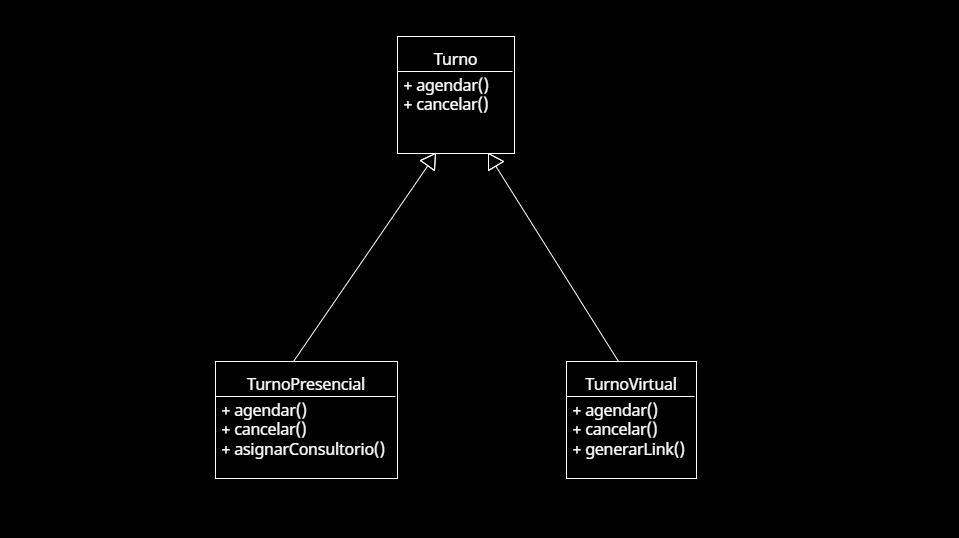

# Principio de Sustitución de Liskov (LSP)

## Propósito y Tipo del Principio SOLID
El **Principio de Sustitución de Liskov (LSP)** establece que las clases derivadas deben poder sustituir a sus clases base sin alterar el funcionamiento correcto del programa. Es decir, si una clase `Hija` hereda de una clase `Padre`, debe poder usarse en lugar de esta última sin que el sistema falle.

En el sistema de turnos, este principio asegura que al extender clases base (por ejemplo, para distintos tipos de usuarios o notificaciones), las nuevas clases puedan reemplazar a las originales sin afectar la lógica del sistema.

---

## Motivación
En una versión previa del sistema, al crear nuevas clases derivadas para manejar distintos tipos de turnos (por ejemplo, `TurnoPresencial` y `TurnoVirtual`), surgían errores si estas clases no respetaban completamente el contrato definido por la clase base `Turno`.

Gracias al uso del LSP, se definieron correctamente las clases derivadas para que pudieran utilizarse de forma intercambiable en cualquier parte donde se espere un `Turno`, sin romper el sistema.

**Ejemplo del mundo real**:  
Si un médico reemplaza a otro en una consulta, debería poder seguir el mismo protocolo sin que los pacientes noten la diferencia. De igual forma, en programación, una subclase debe poder comportarse como su superclase, sin causar problemas inesperados.

---

## Estructura de Clases
El siguiente diagrama UML ilustra cómo las clases `TurnoPresencial` y `TurnoVirtual` heredan de una clase base `Turno`, respetando sus métodos y estructura, permitiendo así su uso intercambiable sin alterar el sistema:

  - `Turno` (clase base)
  - `TurnoPresencial`
  - `TurnoVirtual`

