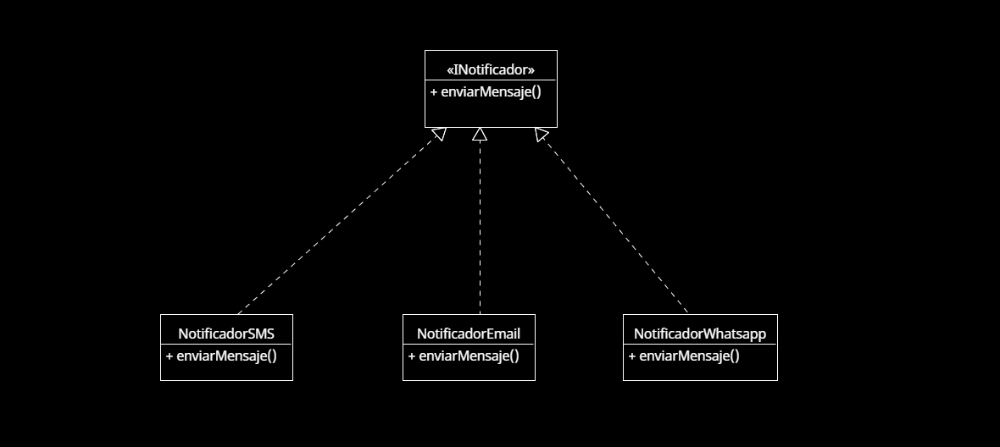

# Principio de Abierto/Cerrado (OCP)

## Propósito y Tipo del Principio SOLID
El principio de **Abierto/Cerrado (OCP)** establece que una clase debe estar **abierta a la extensión** pero **cerrada a la modificación**. Esto significa que debe ser posible añadir nuevas funcionalidades a una clase sin tener que modificar su código existente.

En el contexto del sistema de turnos, este principio permite extender el comportamiento del sistema (por ejemplo, agregar nuevos tipos de notificaciones o filtros de turnos) sin tocar las clases ya existentes, reduciendo el riesgo de introducir errores y facilitando la evolución del sistema.

---

## Motivación
En etapas tempranas del desarrollo, si se requería un nuevo canal de notificación (como correo electrónico además de SMS), era necesario modificar directamente la clase encargada de las notificaciones. Esto no solo hacía el código más difícil de mantener, sino que rompía con la idea de modularidad y reutilización.

Aplicar OCP permitió crear una interfaz `Notificador`, de la cual heredan clases como `NotificadorSMS` y `NotificadorEmail`. Así, al querer agregar un nuevo tipo de notificación (por ejemplo, WhatsApp), solo se debe crear una nueva clase que implemente la interfaz, sin tocar las existentes.

**Ejemplo del mundo real**:  
En una clínica, si se quiere agregar un nuevo método de contacto con los pacientes, no es necesario reentrenar al personal ni rehacer todos los procedimientos, sino simplemente sumar un nuevo canal que funcione de forma independiente al resto.

---

## Estructura de Clases
A continuación se presenta un diagrama UML donde se muestra cómo se aplica el principio OCP en el diseño de clases del sistema. Las clases concretas extienden el comportamiento de una interfaz común sin necesidad de modificar la lógica base:

  - `INotificador` (interfaz)
  - `NotificadorSMS`
  - `NotificadorEmail`
  - `NotificadorWhatsApp` (extensión hipotética)

[Accede a Drive para verlo en Línea](https://drive.google.com/file/d/17cyk0yM9RB97NdbuSebt4lZ0UJB29dOD/view?usp=sharing)
