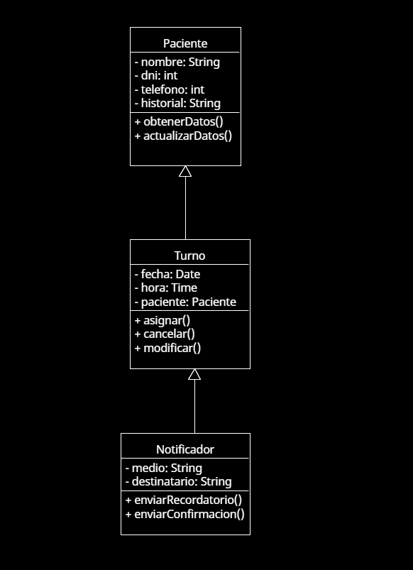

# Principio de Responsabilidad Única (SRP)

## Propósito y Tipo del Principio SOLID
El principio de **Responsabilidad Única (SRP)** establece que una clase debe tener una sola razón para cambiar, es decir, debe tener una única responsabilidad o función dentro del sistema. Este principio se aplica para mantener el código más modular y fácil de mantener.

En el contexto del **Sistema de Gestión de Turnos Médicos**, el SRP ayuda a separar claramente las responsabilidades entre las clases que manejan la lógica de turnos, la administración de pacientes y la confirmación de citas, lo cual facilita la escalabilidad y el mantenimiento del sistema.

---

## Motivación
En la versión inicial del sistema, una sola clase se encargaba de gestionar tanto los datos de los pacientes como la lógica de turnos y las notificaciones de confirmación. Esto hacía difícil realizar cambios sin afectar otras partes del sistema.

Aplicar SRP permitió dividir estas tareas en diferentes clases: una para gestionar pacientes, otra para manejar los turnos, y otra dedicada a las notificaciones. Esto mejora el mantenimiento del sistema, ya que ahora cada clase tiene una única responsabilidad clara.

**Ejemplo del mundo real**:  
Un recepcionista en un centro de salud no debería encargarse de tareas de facturación, confirmaciones telefónicas y diagnóstico médico al mismo tiempo. Del mismo modo, cada clase en el sistema debe cumplir un solo rol específico.

---

## Estructura de Clases
A continuación se incluye un diagrama UML que muestra cómo se aplicó el principio SRP al diseño del sistema. Cada clase tiene una función clara y diferenciada:

- `Paciente`: Maneja los datos personales y médicos de cada paciente.
- `Turno`: Se encarga de la lógica de asignación, cancelación y modificación de turnos.
- `Notificador`: Responsable de enviar recordatorios o confirmaciones de turnos.

> El diagrama refleja cómo estas clases están desacopladas y se relacionan solo mediante responsabilidades bien definidas.

